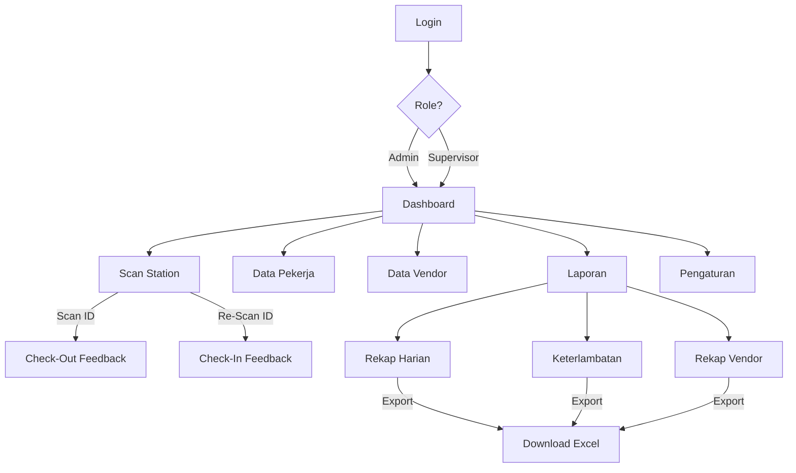

# 📋 Frontend Plan — Sistem Absensi Istirahat Pekerja

> **Konteks:** Aplikasi web untuk mengelola absensi istirahat 50–200 pekerja menggunakan _dedicated scanner_ (USB/Bluetooth barcode scanner). Durasi istirahat standar: **60 menit**. Sistem menggunakan logika **Toggle Status** (Check-Out / Check-In).

---

## 1. Filosofi Desain

| Aspek             | Keputusan                                                                                                                                                               |
| ----------------- | ----------------------------------------------------------------------------------------------------------------------------------------------------------------------- |
| **Gaya Visual**   | Modern dashboard dengan **dark mode** sebagai default (ramah mata di lingkungan pabrik/kantor shift). Aksen warna menggunakan gradasi **biru–cyan** untuk elemen utama. |
| **Prioritas UX**  | **Speed & Clarity** — Admin hanya perlu melihat sekilas, informasi kritis harus terlihat dalam < 2 detik.                                                               |
| **Responsivitas** | Desktop-first (monitor admin), dengan fallback tablet untuk supervisor di lantai kerja.                                                                                 |
| **Tipografi**     | Google Fonts **Inter** — bersih, modern, sangat mudah dibaca di berbagai ukuran layar.                                                                                  |

---

## 2. Struktur Halaman & Navigasi

Navigasi menggunakan **sidebar kiri** yang _collapsible_ dan **top bar** untuk info user + notifikasi.

```
┌──────────────────────────────────────────────────┐
│  TOP BAR  [Logo]  [Nama Admin]  [🔔 Notifikasi] │
├────────┬─────────────────────────────────────────┤
│        │                                         │
│  SIDE  │           MAIN CONTENT AREA             │
│  BAR   │                                         │
│        │                                         │
│  ────  │                                         │
│  Menu  │                                         │
│  Items │                                         │
│        │                                         │
└────────┴─────────────────────────────────────────┘
```

### Hierarki Menu Sidebar

| No  | Menu             | Icon | Deskripsi                                                           | Akses |
| --- | ---------------- | ---- | ------------------------------------------------------------------- | ----- |
| 1   | **Dashboard**    | 🏠   | Overview real-time: siapa yang sedang istirahat, statistik hari ini | Semua |
| 2   | **Scan Station** | 📷   | Halaman utama scanning — tampilan layar besar untuk meja admin      | Admin |
| 3   | **Data Pekerja** | 👥   | CRUD data pekerja (Nama, Barcode ID, Ops Unit, Vendor, Foto)        | Admin |
| 4   | **Data Vendor**  | 🏢   | CRUD data vendor (Nama Vendor, PIC)                                 | Admin |
| 5   | **Laporan**      | 📊   | Rekap harian, laporan keterlambatan, export Excel                   | Semua |
| 6   | **Pengaturan**   | ⚙️   | Konfigurasi durasi istirahat, koneksi scanner, manajemen user       | Admin |

---

## 3. Detail Halaman per Fitur

### 3.1 🏠 Dashboard (Home)

Halaman pertama setelah login. Menampilkan ringkasan kondisi istirahat secara **real-time**.

#### Layout (Grid 2 kolom utama)

**Baris Atas — Stat Cards (4 kartu horizontal)**

| Kartu                  | Isi                           | Warna        |
| ---------------------- | ----------------------------- | ------------ |
| Total Pekerja Aktif    | Jumlah pekerja terdaftar      | Biru         |
| Sedang Istirahat       | Jumlah sedang di luar         | Kuning/Amber |
| Overdue (> 60 min)     | Jumlah yang terlambat kembali | Merah        |
| Sudah Kembali Hari Ini | Jumlah sudah check-in         | Hijau        |

**Kolom Kiri — Tabel Live "Sedang Istirahat"**

- Kolom: No, Foto (thumbnail), Nama, Ops Unit, Vendor, Jam Keluar, **Durasi** (countdown timer), Status.
- Baris berwarna **merah** jika durasi > 60 menit (overdue).
- Baris berwarna **kuning** jika durasi > 50 menit (peringatan).
- Auto-refresh setiap 10 detik tanpa reload halaman.

**Kolom Kanan — Panel Informasi**

- **Donut Chart:** Distribusi pekerja istirahat per Vendor.
- **Bar Chart:** Jumlah istirahat per Ops Unit hari ini.
- **Activity Feed:** Log 10 scan terakhir (Check-Out / Check-In) secara real-time.

---

### 3.2 📷 Scan Station

Halaman khusus untuk **meja admin** yang terhubung dengan scanner. Dirancang untuk **tampilan layar penuh** agar mudah dilihat oleh pekerja yang sedang scan.

#### Layout (Fullscreen-optimized, 2 panel)

**Panel Kiri (60%) — Feedback Visual**

- **Idle State:** Logo perusahaan + teks "Silakan Scan ID Card Anda" dengan animasi pulse.
- **Setelah Scan (Check-Out):**
  - Foto pekerja (besar, bulat, dengan border hijau).
  - Nama, Ops Unit, Vendor.
  - Status: `🟢 CHECK-OUT — Istirahat Dimulai`
  - **Countdown Timer besar:** `60:00` yang mulai menghitung mundur.
  - Animasi transisi _slide-in_ yang smooth.
- **Setelah Scan (Check-In):**
  - Foto pekerja.
  - Status: `🔵 CHECK-IN — Selamat Bekerja Kembali`
  - Total Durasi Istirahat: `00:45:23`
  - Jika overdue: `🔴 TERLAMBAT 12 menit` dengan background merah.
  - Animasi yang berbeda (misalnya _fade-in_ dengan ikon centang).

**Panel Kanan (40%) — Antrian / Log Terkini**

- Daftar 5–10 scan terakhir dalam bentuk kartu kecil:
  - Foto mini, Nama, Waktu Scan, Status (Out/In).
- Berguna saat trafik tinggi agar admin bisa melihat riwayat singkat.

#### Interaksi

- Input barcode diterima sebagai **keyboard input** (scanner bertindak sebagai keyboard).
- Sebuah _hidden input field_ yang selalu fokus akan menangkap input scanner.
- Setelah barcode diterima: proses → tampilkan feedback 5 detik → kembali ke idle.

---

### 3.3 👥 Data Pekerja

Halaman CRUD untuk mengelola database pekerja.

#### Layout

- **Top Bar:** Tombol `+ Tambah Pekerja`, Search bar, Filter (Ops Unit, Vendor).
- **Tabel Data:**
  - Kolom: No, Foto, ID Barcode, Nama, Ops Unit, Vendor, Aksi (Edit / Hapus).
  - Pagination (25 per halaman).
  - Sorting per kolom.
- **Modal Form (Tambah/Edit):**
  - Field: ID Barcode (bisa di-scan langsung), Nama Lengkap, Pilih Ops Unit (dropdown), Pilih Vendor (dropdown), Upload Foto.
  - Validasi real-time: ID Barcode harus unik.
- **Import Massal:**
  - Tombol `Import dari Excel` untuk onboarding banyak pekerja sekaligus.

---

### 3.4 🏢 Data Vendor

Halaman CRUD sederhana untuk mengelola data vendor.

#### Layout

- **Top Bar:** Tombol `+ Tambah Vendor`, Search bar.
- **Tabel Data:**
  - Kolom: No, Nama Vendor, PIC Vendor, Jumlah Pekerja Terdaftar, Aksi (Edit / Hapus).
- **Modal Form (Tambah/Edit):**
  - Field: Nama Vendor, Nama PIC, Kontak PIC.

---

### 3.5 📊 Laporan

Halaman untuk melihat rekap dan mengunduh laporan.

#### Layout

- **Tab Navigasi Horizontal:**

  | Tab           | Isi                                                           |
  | ------------- | ------------------------------------------------------------- |
  | Rekap Harian  | Tabel semua aktivitas istirahat hari yang dipilih             |
  | Keterlambatan | Daftar pekerja yang melebihi 60 menit + total menit terlambat |
  | Rekap Vendor  | Ringkasan performa kedisiplinan per vendor                    |

- **Filter Bar (setiap tab):**
  - Date Picker (rentang tanggal).
  - Dropdown: Ops Unit, Vendor.
  - Tombol: `🔍 Tampilkan` dan `📥 Export Excel`.
- **Tabel Hasil:**
  - Kolom dinamis sesuai tab.
  - Baris overdue tetap diberi highlight merah.
  - Footer tabel: total record, rata-rata durasi istirahat.

---

### 3.6 ⚙️ Pengaturan

Halaman konfigurasi sistem.

#### Sections (menggunakan Tabs atau Accordion)

| Section          | Isi                                                                             |
| ---------------- | ------------------------------------------------------------------------------- |
| **Umum**         | Durasi istirahat default (default 60 menit, bisa diubah), Nama perusahaan, Logo |
| **Scanner**      | Status koneksi scanner, Test scan, Konfigurasi port                             |
| **User & Akses** | CRUD user admin, pengaturan role (Admin / Supervisor)                           |
| **Offline Mode** | Status sinkronisasi, jumlah data pending, tombol Sync Manual                    |

---

## 4. Komponen UI Reusable

| Komponen         | Deskripsi                                                                            |
| ---------------- | ------------------------------------------------------------------------------------ |
| `StatCard`       | Kartu statistik dengan ikon, angka besar, label, dan warna aksen                     |
| `WorkerRow`      | Baris tabel pekerja dengan foto mini, countdown timer, dan badge status              |
| `ScanFeedback`   | Panel besar untuk menampilkan hasil scan (foto, nama, timer)                         |
| `CountdownTimer` | Timer yang menghitung mundur dari 60 menit, berubah warna saat > 50 min dan > 60 min |
| `DataTable`      | Tabel universal dengan sorting, pagination, search, dan filter                       |
| `ModalForm`      | Modal dialog untuk form Tambah/Edit dengan validasi                                  |
| `DonutChart`     | Chart distribusi vendor (wrapper chart library)                                      |
| `BarChart`       | Grafik batang untuk statistik harian                                                 |
| `ActivityFeed`   | Log aktivitas scan terbaru secara real-time                                          |
| `AlertBanner`    | Banner notifikasi untuk overdue atau error koneksi                                   |
| `SidebarNav`     | Navigasi sidebar yang collapsible                                                    |
| `TopBar`         | Bar atas dengan logo, nama user, dan notifikasi                                      |

---

## 5. Sistem Warna & Status

```
Primary        : #3B82F6 (Biru)         → Elemen utama, tombol, link
Primary Dark   : #1E3A5F                 → Sidebar, background utama dark mode
Accent         : #06B6D4 (Cyan)          → Highlight, hover state
Success        : #10B981 (Hijau)         → Check-In, status aktif
Warning        : #F59E0B (Amber)         → Durasi > 50 menit, peringatan
Danger         : #EF4444 (Merah)         → Overdue > 60 menit, error
Neutral BG     : #0F172A (Slate 900)     → Background utama dark mode
Card BG        : #1E293B (Slate 800)     → Background kartu/panel
Text Primary   : #F1F5F9 (Slate 100)     → Teks utama
Text Secondary : #94A3B8 (Slate 400)     → Teks sekunder, label
Border         : #334155 (Slate 700)     → Garis pembatas
```

---

## 6. Alur Navigasi Pengguna (User Flow)



---

## 7. Animasi & Micro-Interactions

| Elemen             | Animasi                                                              |
| ------------------ | -------------------------------------------------------------------- |
| Stat Cards         | Angka counter _count-up_ saat halaman dimuat                         |
| Countdown Timer    | Pulse effect saat < 10 menit tersisa, **shake** saat overdue         |
| Scan Feedback      | _Slide-in_ dari kanan saat scan berhasil, _fade-out_ kembali ke idle |
| Tabel Overdue Row  | Subtle _glow_ merah berkedip pada baris terlambat                    |
| Sidebar Menu       | Smooth _collapse/expand_ dengan ikon rotasi                          |
| Toast Notification | _Slide-down_ dari atas untuk notifikasi sukses/error                 |
| Modal              | _Scale-up_ dengan backdrop blur                                      |
| Chart              | Animated draw-in saat pertama kali render                            |
| Button Hover       | Subtle _lift_ (translateY -2px) + shadow increase                    |

---

## 8. Prioritas Implementasi (Roadmap)

| Fase                | Halaman                                     | Prioritas |
| ------------------- | ------------------------------------------- | --------- |
| **Fase 1 — MVP**    | Login, Scan Station, Dashboard (tabel live) | 🔴 Tinggi |
| **Fase 2 — Data**   | Data Pekerja (CRUD), Data Vendor (CRUD)     | 🟠 Sedang |
| **Fase 3 — Report** | Laporan (3 tab + Export Excel)              | 🟡 Sedang |
| **Fase 4 — Polish** | Pengaturan, Offline Mode, Animasi lanjutan  | 🟢 Rendah |

---

## 9. Teknologi Frontend

| Layer             | Teknologi                                                              |
| ----------------- | ---------------------------------------------------------------------- |
| **Framework**     | **Next.js 14+** (App Router) — React-based fullstack framework         |
| **Bahasa**        | **TypeScript** — type safety untuk skala 50–200 data pekerja           |
| **Styling**       | **CSS Modules** + CSS Custom Properties (variabel warna di atas)       |
| **Chart**         | Recharts atau ApexCharts (React-compatible)                            |
| **Icons**         | Lucide React (ringan, tree-shakeable)                                  |
| **Font**          | `next/font` — Google Fonts Inter (optimized, no layout shift)          |
| **Export Excel**  | SheetJS (xlsx) — client-side export                                    |
| **State Mgmt**    | React Context + `useState`/`useReducer` (cukup untuk skala ini)        |
| **Real-time**     | `useEffect` + `setInterval` polling, atau WebSocket jika backend ada   |
| **Scanner Input** | Hidden `<input>` auto-focus yang menangkap keyboard input dari scanner |
| **API Routes**    | Next.js Route Handlers (`/app/api/`) untuk backend logic               |
| **Database**      | Prisma ORM + SQLite (lokal) atau PostgreSQL (production)               |
| **Auth**          | NextAuth.js untuk login Admin / Supervisor                             |

### Struktur Folder Next.js (App Router)

```
e:\portofolio\absensi\
├── app/
│   ├── layout.tsx              # Root layout (Sidebar + TopBar)
│   ├── page.tsx                # Dashboard (Home)
│   ├── login/
│   │   └── page.tsx            # Halaman Login
│   ├── scan/
│   │   └── page.tsx            # Scan Station (fullscreen)
│   ├── pekerja/
│   │   └── page.tsx            # Data Pekerja (CRUD)
│   ├── vendor/
│   │   └── page.tsx            # Data Vendor (CRUD)
│   ├── laporan/
│   │   └── page.tsx            # Laporan (3 tab)
│   ├── pengaturan/
│   │   └── page.tsx            # Pengaturan
│   └── api/
│       ├── pekerja/route.ts    # API: CRUD Pekerja
│       ├── vendor/route.ts     # API: CRUD Vendor
│       ├── scan/route.ts       # API: Proses Scan (toggle)
│       └── laporan/route.ts    # API: Data Laporan + Export
├── components/
│   ├── layout/
│   │   ├── Sidebar.tsx
│   │   └── TopBar.tsx
│   ├── dashboard/
│   │   ├── StatCard.tsx
│   │   ├── LiveTable.tsx
│   │   ├── DonutChart.tsx
│   │   ├── BarChart.tsx
│   │   └── ActivityFeed.tsx
│   ├── scan/
│   │   ├── ScanFeedback.tsx
│   │   └── CountdownTimer.tsx
│   ├── shared/
│   │   ├── DataTable.tsx
│   │   ├── ModalForm.tsx
│   │   └── AlertBanner.tsx
│   └── ui/
│       ├── Button.tsx
│       ├── Badge.tsx
│       └── Input.tsx
├── lib/
│   ├── db.ts                   # Prisma client instance
│   └── utils.ts                # Helper functions
├── styles/
│   ├── globals.css             # CSS Custom Properties + base styles
│   └── variables.css           # Variabel warna & spacing
├── prisma/
│   └── schema.prisma           # Database schema
├── public/
│   └── images/                 # Logo, placeholder foto
├── next.config.js
├── tsconfig.json
└── package.json
```

---

> **Catatan:** Dokumen ini adalah panduan UX/UI dan navigasi frontend. Setelah disetujui, langkah berikutnya adalah membangun masing-masing halaman sesuai roadmap Fase 1–4 di atas.
